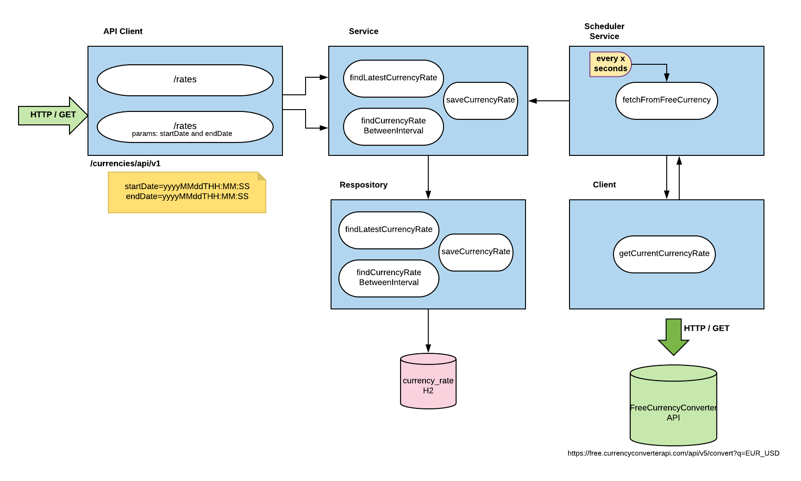

# Exchange Currency Rate App (currency-rate)
A simple application responsible for get currency rate from EUR to USD frequently.

The application has two endpoint which permit you to access the latest currency rate on the database and get all currencies rates from a interval of time.

Every period the exchange rate is fetched from an external resource, and it is possible to configure the frequency by editing (in miliseconds) the property `currency.rate.frequency` inside the file [application.properties](src/main/resources/application.properties).

[Diagram](img/diagram.png)